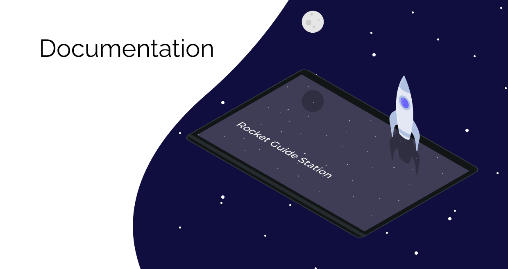

Repositório destinado à documentação do projeto

## Relatórios

- [Ponto de Controle 1](reports/PI2_PC1_fogueteiros.pdf)
- [Ponto de Controle 2](reports/PI2_PC2_fogueteiros.pdf)
- [Ponto de Controle 3](reports/PI2_PC3_fogueteiros.pdf)
- [Diagramas Elétricos](electric-diagrams/)
- [CADs e imagens Estrutura](Estrutura/)

## Manuais

- [Manual de Montagem](manuals/Manual_de_montagem.pdf)
- [Manual de Uso](manuals/Manual_do_usuario.pdf)

## Apresentações

- [Apresentação do Ponto de Controle 1](presentations/apresentacao_PC01.pdf)
- [Apresentação do Ponto de Controle 1](presentations/apresentacao_PC2.pdf)
